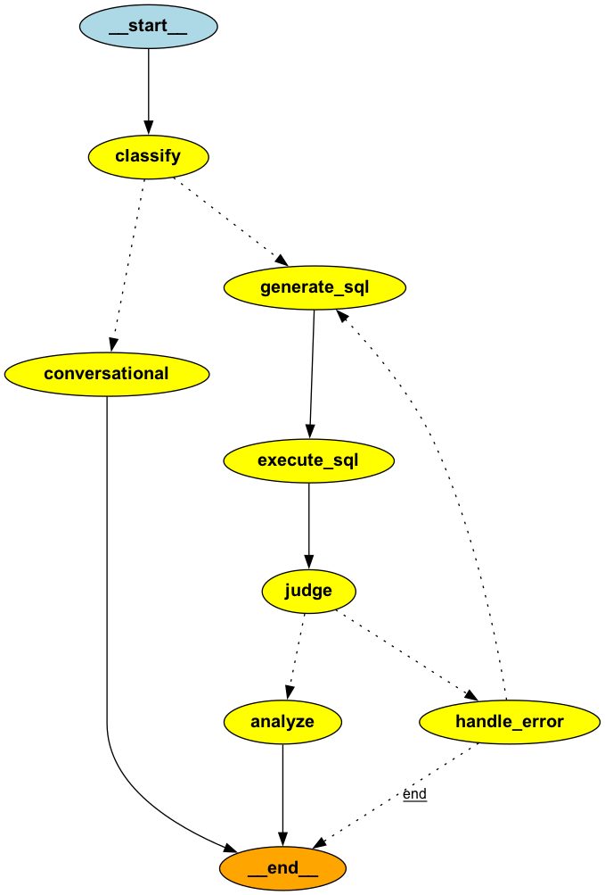

# E-Commerce Marketplace Database & Analytics Platform

An end-to-end data engineering and AI-powered analytics platform for an eBay-like marketplace, featuring natural language SQL generation, intelligent customer service chatbots, and comprehensive business intelligence.

## What This Project Can Do

### AI-Powered SQL Agent

**Natural Language to SQL Query Generation**
- Convert business questions into optimized SQL queries automatically
- Intelligent question classification (SQL queries vs. conversational questions)
- Automatic query validation and error handling with retry logic
- SQL result analysis and insights generation using AI
- Built with LangGraph for stateful workflow orchestration

**Key Features:**
- Smart routing between SQL queries and conversational responses
- Automatic SQL query correction and suggestion when errors occur
- Result validation to ensure queries answer the user's question
- Comprehensive data analysis with AI-generated insights

### Customer Service Chatbot

**Intelligent Customer Support System**
- Natural language customer support chatbot
- FAQ knowledge base integration
- Order lookup and tracking capabilities
- Product review retrieval
- Policy document search using RAG (Retrieval-Augmented Generation)
- Multi-turn conversation support with context awareness

**Capabilities:**
- Answer customer questions about orders, products, and policies
- Retrieve customer order history
- Access product reviews and ratings
- Search return and shipping policy documents using semantic search
- Provide personalized responses based on customer data

#### Chatbot Tool-Call Flow

```mermaid
flowchart TD
    U[User] --> C[Chatbot Entry]
    C --> LLM[LLM with Tools (LangChain)]
    LLM --> D{Any tool calls?}
    D -- No --> A[Return final answer]
    D -- Yes --> E[Execute tool call(s)]

    subgraph Tools
      T1[faq → call_functions("faq")] 
      T2[get_my_orders → call_functions("get_my_orders")] 
      T3[get_product_reviews → call_functions("get_product_reviews")] 
      T4[query_policies_docs → call_functions("query_policies_docs")] 
    end

    E --> T1
    E --> T2
    E --> T3
    E --> T4

    T4 --> V[Embeddings + ChromaDB search]
    T1 --> R[Tool Results]
    T2 --> R
    T3 --> R
    V --> R

    R --> M[Append ToolMessage to messages]
    M --> LLM
    LLM --> D

    note right of LLM: Iterates up to max_attempts
```

### Business Analytics & Reporting

**Comprehensive Business Intelligence**

**Revenue Analysis:**
- Total revenue calculations and trends
- Monthly revenue growth analysis
- Category performance with Pareto analysis
- Seller revenue rankings and commission breakdowns

**Customer Analytics:**
- Customer Lifetime Value (CLV) calculations
- RFM segmentation (Recency, Frequency, Monetary)
- Cohort retention analysis
- Bid-to-purchase conversion tracking

**Product Insights:**
- Best-selling products by revenue and quantity
- Product ratings and review sentiment analysis
- Slow-moving inventory identification
- Bidding activity and conversion rates

**Operational Analytics:**
- Order processing efficiency metrics
- Shipping and logistics performance
- Staff productivity analysis
- Department performance tracking

### Data Quality & Validation

**Automated Data Quality Checks**
- Missing email validation
- Orders without payment verification
- Price validation and anomaly detection
- Product-seller relationship integrity checks
- Automated quality reports with pass/fail metrics
- Export validation results to CSV

### RESTful API

**FastAPI-Based API Server**
- `/analyze` - Natural language to SQL analysis endpoint
- `/chat` - Customer service chatbot endpoint
- `/health` - System health monitoring
- `/profile` - User profile management
- JWT-based authentication and authorization
- CORS support for frontend integration
- Interactive API documentation

### RAG (Retrieval-Augmented Generation) System

**Document Intelligence**
- PDF document processing (return policies, shipping policies)
- Semantic search using vector embeddings
- ChromaDB for persistent vector storage
- OpenAI embeddings for semantic similarity
- Context-aware document retrieval for chatbot responses

## Database Architecture

**17-Table Normalized Schema:**
- **Core Entities**: Customer, Seller, Product, Staff, Department
- **Transactions**: Order_Header, Payment, Bid, Shipping
- **Analytics**: Customer_Review, Seller_Review, Order_History
- **Logistics**: Import_Distribution, Export_Distribution, Customer/Seller Service
- **App Users**: App_User for authentication and access control


## System Architecture

**AI Agent Workflow:**
- LangGraph-based state machine for SQL agent
- Intelligent error handling and retry mechanisms
- Multi-step query generation and validation
- Result analysis and insight generation




## Tech Stack

**Backend:**
- **Database**: PostgreSQL
- **Languages**: Python, SQL
- **AI/ML**: OpenAI GPT-4o-mini, LangChain, LangGraph
- **Vector Database**: ChromaDB
- **API Framework**: FastAPI
- **Authentication**: JWT (JSON Web Tokens)

