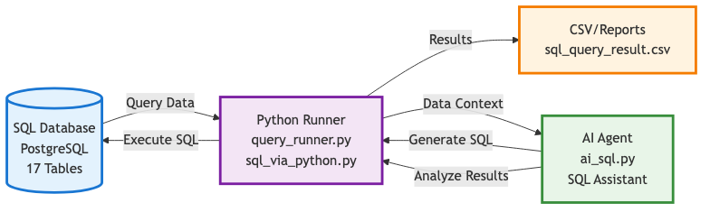
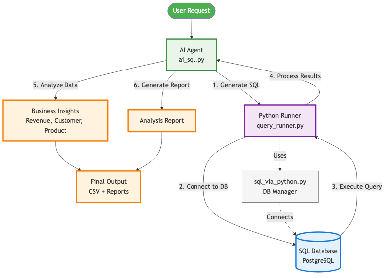

# E-Commerce Marketplace Database & Analytics

A end-to-end data engineering project demonstrating RDBMS design, advanced SQL analytics, and Python ETL automation for an eBay-like marketplace.

## Project Overview

This project showcases end-to-end data engineering skills:
- **Database Design**: Normalized relational schema with 17 tables modeling sellers, customers, products, orders, bidding, and logistics
- **SQL Analytics**: Queries solving real business problems using CTEs, window functions
- **Python ETL**: Automated pipeline for executing SQL analyses

## Tech Stack

- **Database**: PostgreSQL
- **Languages**: SQL, Python 
- **Libraries**: psycopg2, pandas, python-dotenv, tabulate
- **Tools**: DBeaver/pgAdmin, Git

## Database Schema

17-table marketplace database including:
- **Core Entities**: Customer, Seller, Product, Staff, Department
- **Transactions**: Order_Header, Payment, Bid, Shipping
- **Analytics**: Customer_Review, Seller_Review, Order_History
- **Logistics**: Import_Distribution, Export_Distribution, Customer/Seller Service

## Project Diagrams

Visual documentation of the system architecture and data flow:

##  Business Analytics Implemented

### 1. Revenue Analysis (`sql/1.revenue_analysis.sql`)
- Total revenue calculations
- Monthly revenue trends with growth rates
- Category performance and Pareto analysis
- Seller revenue rankings with commission breakdown

### 2. Customer Analytics (`sql/2.customer_analysis.sql`)
- Customer lifetime value (CLV)
- RFM segmentation (Recency, Frequency, Monetary)
- Cohort retention analysis
- Bid-to-purchase conversion analysis

### 3. Product Insights (`sql/3.product_analysis.sql`)
- Best-selling products by revenue and quantity
- Product ratings and review analysis
- Slow-moving inventory identification
- Bidding activity and conversion rates

## Python ETL Components

### Database Manager (`script/sql_via_python.py`)
- Connection pooling and management
- Secure credential handling via environment variables
- Query execution with error handling

### Query Runner (`script/query_runner.py`)
- Automated execution of SQL analysis files
- Results export to CSV
- Formatted output display
