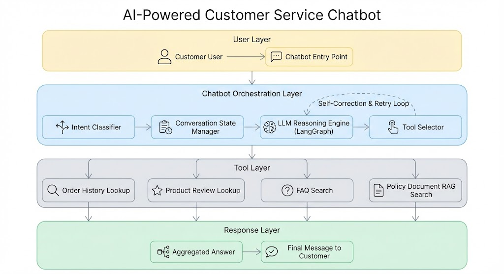

# E-Commerce Marketplace Database & Analytics

An end-to-end data engineering and AI-powered analytics platform for an eBay-like marketplace, with natural language SQL generation, and comprehensive business intelligence.

## Documentation Index

Quick navigation to documentation:

- **[SQL Generator](script/sql_generator/README.md)** - AI-powered natural language to SQL conversion for internal analytics
- **[Customer Chatbot](script/chatbot/README.md)** - Intelligent customer service chatbot with tool-based architecture
- **[Data Engineering & Analytics](sql/README.md)** - Database schema, SQL queries, and data validation

## What This Project Can Do

### AI-Powered SQL Generator (Internal Use)
- **Natural Language to SQL** conversion using OpenAI GPT-4o-mini
- **Error Handling & Retry Logic** - Automatic query correction with LangGraph state machine
- **Result Validation** - Ensures generated queries answer the user's question
- **AI-Powered Analysis** - Generates insights and business implications from query results

📖 **[Read the complete SQL Generator documentation →](script/sql_generator/README.md)**

### Customer Service Chatbot
A tool-based chatbot powered featuring:
- **Multi-Tool Architecture** - FAQ, order lookup, product reviews, policy search
- **RAG Integration** - Semantic search of return/shipping policy documents using ChromaDB
- **Multi-Turn Conversations** - Context-aware conversations with conversation history
- **Database & Evaluation** - Direct SQL queries for order and product data and evaluate/monitor by LangSmith
  

#### Chatbot Tool-Call Flow

User prompt -> Tool calls (RAG, SQL execute) -> Response 

📖 **[Read the complete Customer Chatbot documentation →](script/chatbot/README.md)**

### Data Engineering & Analytics
This project includes a complete data engineering implementation with:
- **17-table normalized database schema** (PostgreSQL)
- **Revenue, Customer, Product, and Operational Analytics** - Advanced SQL queries for business intelligence
- **Data Quality & Validation** 

📖 **[Read the complete Data Engineering documentation →](sql/README.md)**

📖 **[SQL Analysis Report →](../result/report.md)**

### RAG (Retrieval-Augmented Generation) System
- PDF document processing (return policies, shipping policies)
- Semantic search using vector embeddings
- Context-aware document retrieval for chatbot responses

## Database Architecture

**17-Table Normalized Schema:**
- **Core Entities**: Customer, Seller, Product, Staff, Department
- **Transactions**: Order_Header, Payment, Bid, Shipping
- **Analytics**: Customer_Review, Seller_Review, Order_History
- **Logistics**: Import_Distribution, Export_Distribution, Customer/Seller Service
- **App Users**: App_User for authentication and access control

## System Architecture

**AI Agent Workflow:**
- LangGraph-based state machine for SQL agent
- Intelligent error handling and retry mechanisms
- Multi-step query generation and validation
- Result analysis and insight generation
