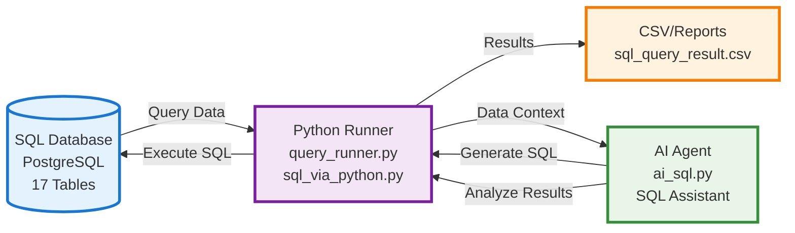

# Project Core Flow - RDMS Project

```mermaid
graph LR
    %% Core Components
    DB[(SQL Database<br/>PostgreSQL<br/>17 Tables)] 
    RUNNER[Python Runner<br/>query_runner.py<br/>sql_via_python.py]
    AI[AI Agent<br/>ai_sql.py<br/>SQL Assistant]
    
    %% Data Flow
    DB -->|Query Data| RUNNER
    RUNNER -->|Execute SQL| DB
    RUNNER -->|Results| OUTPUT[CSV/Reports<br/>sql_query_result.csv]
    
    %% AI Integration
    AI -->|Generate SQL| RUNNER
    AI -->|Analyze Results| RUNNER
    RUNNER -->|Data Context| AI
    
    %% Styling
    classDef database fill:#e3f2fd,stroke:#1976d2,stroke-width:3px
    classDef python fill:#f3e5f5,stroke:#7b1fa2,stroke-width:3px
    classDef ai fill:#e8f5e8,stroke:#388e3c,stroke-width:3px
    classDef output fill:#fff3e0,stroke:#f57c00,stroke-width:3px
    
    class DB database
    class RUNNER python
    class AI ai
    class OUTPUT output
```
