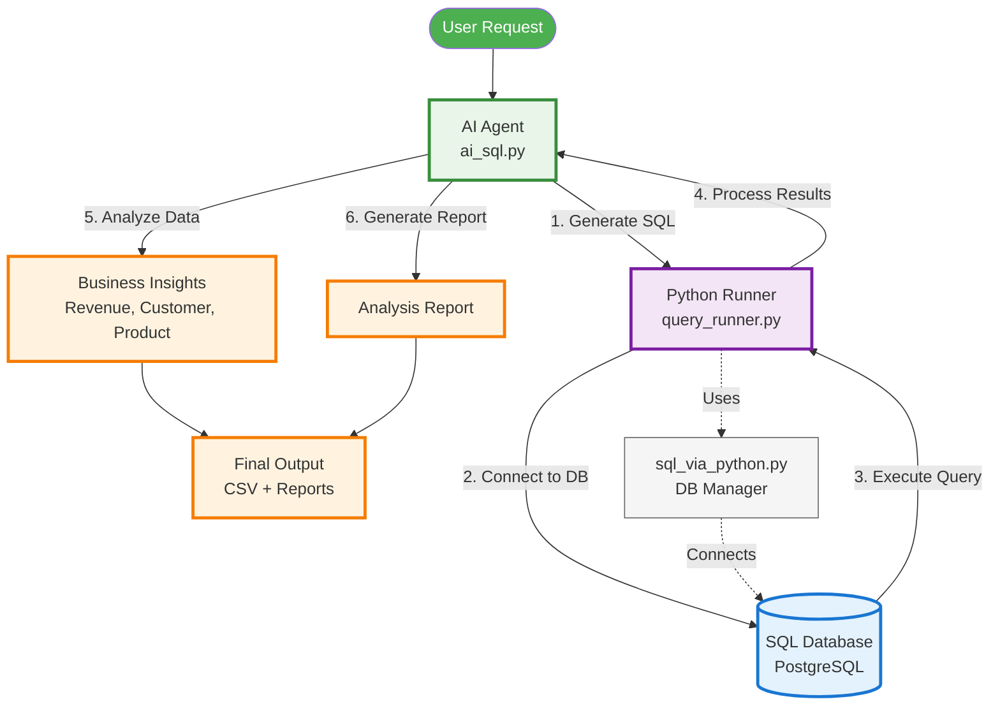

# Detailed Core Flow - RDMS Project

```mermaid
flowchart TD
    %% Main Flow
    START([User Request]) --> AI[AI Agent<br/>ai_sql.py]
    
    %% AI Processing
    AI -->|1. Generate SQL| RUNNER[Python Runner<br/>query_runner.py]
    RUNNER -->|2. Connect to DB| DB[(SQL Database<br/>PostgreSQL)]
    
    %% Database Operations
    DB -->|3. Execute Query| RUNNER
    RUNNER -->|4. Process Results| AI
    
    %% AI Analysis
    AI -->|5. Analyze Data| INSIGHTS[Business Insights<br/>Revenue, Customer, Product]
    AI -->|6. Generate Report| REPORT[Analysis Report]
    
    %% Output
    INSIGHTS --> OUTPUT[Final Output<br/>CSV + Reports]
    REPORT --> OUTPUT
    
    %% Supporting Components
    RUNNER -.->|Uses| SQL_PY[sql_via_python.py<br/>DB Manager]
    SQL_PY -.->|Connects| DB
    
    %% Styling
    classDef start fill:#4caf50,color:#fff
    classDef ai fill:#e8f5e8,stroke:#388e3c,stroke-width:3px
    classDef python fill:#f3e5f5,stroke:#7b1fa2,stroke-width:3px
    classDef database fill:#e3f2fd,stroke:#1976d2,stroke-width:3px
    classDef output fill:#fff3e0,stroke:#f57c00,stroke-width:3px
    classDef support fill:#f5f5f5,stroke:#666,stroke-width:1px
    
    class START start
    class AI ai
    class RUNNER python
    class DB database
    class INSIGHTS,REPORT,OUTPUT output
    class SQL_PY support
```
