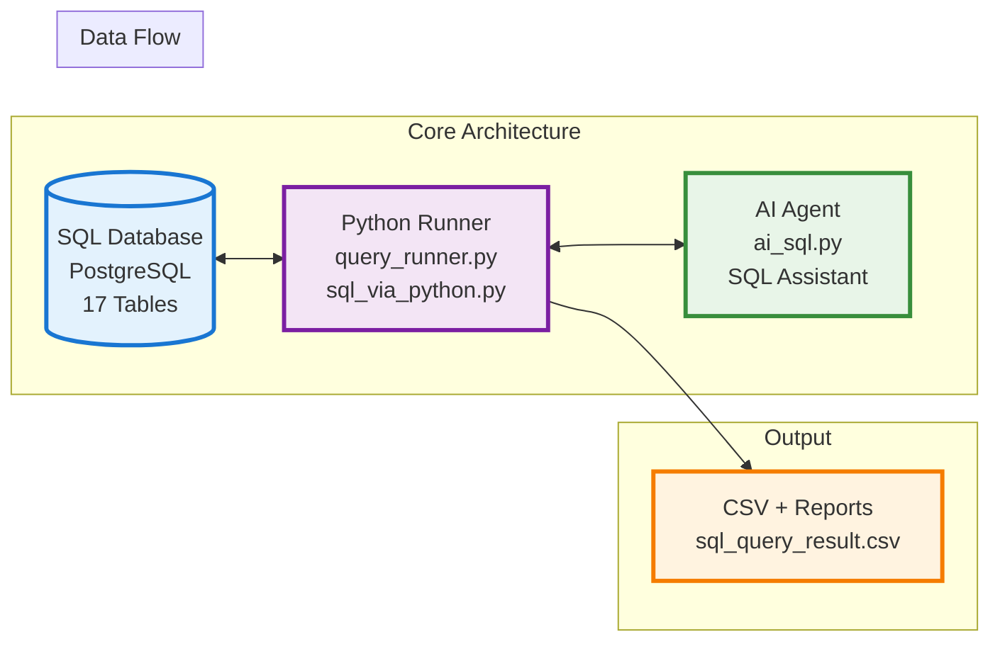

# Simple Project Overview - RDMS Project

```mermaid
graph LR
    subgraph "Core Architecture"
        DB[(SQL Database<br/>PostgreSQL<br/>17 Tables)]
        RUNNER[Python Runner<br/>query_runner.py<br/>sql_via_python.py]
        AI[AI Agent<br/>ai_sql.py<br/>SQL Assistant]
    end
    
    subgraph "Data Flow"
        DB <--> RUNNER
        RUNNER <--> AI
    end
    
    subgraph "Output"
        OUTPUT[CSV + Reports<br/>sql_query_result.csv]
    end
    
    RUNNER --> OUTPUT
    
    %% Styling
    classDef database fill:#e3f2fd,stroke:#1976d2,stroke-width:3px
    classDef python fill:#f3e5f5,stroke:#7b1fa2,stroke-width:3px
    classDef ai fill:#e8f5e8,stroke:#388e3c,stroke-width:3px
    classDef output fill:#fff3e0,stroke:#f57c00,stroke-width:3px
    
    class DB database
    class RUNNER python
    class AI ai
    class OUTPUT output
```
