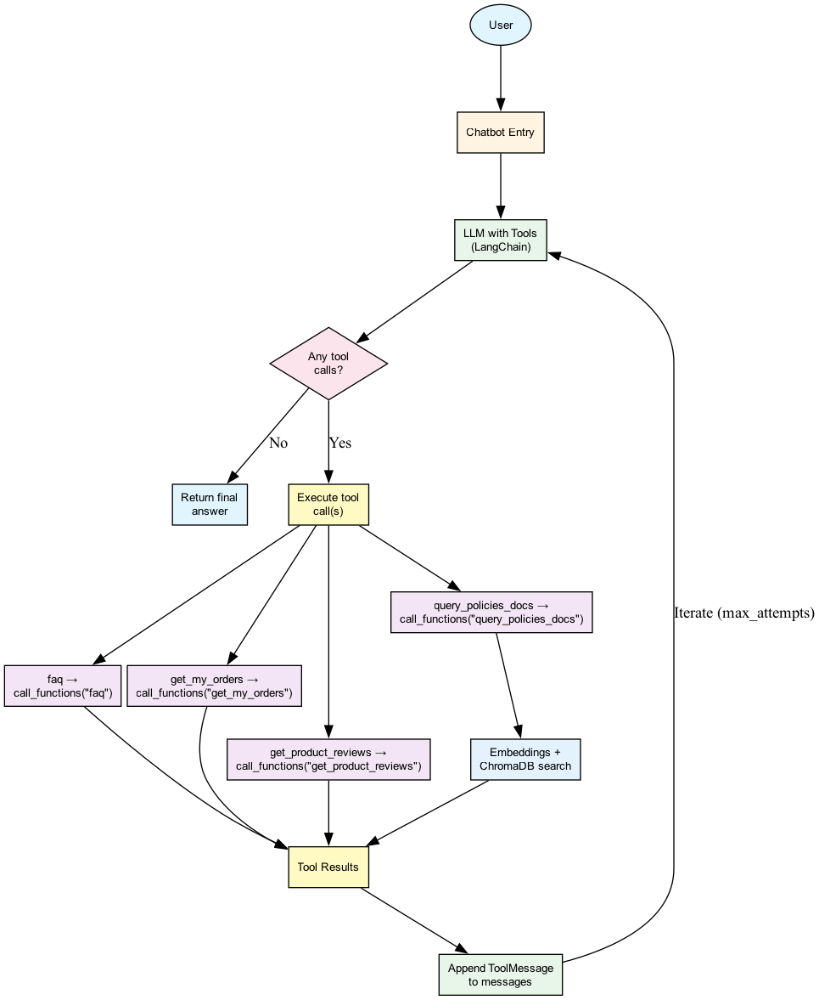
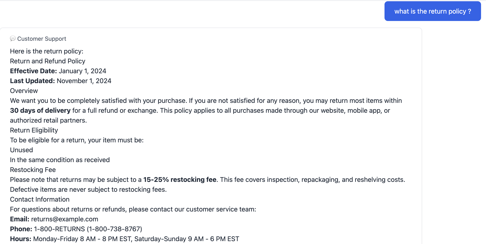

# Customer Service Chatbot

An AI-powered customer service chatbot including conversations, tool-based function calling, and RAG (Retrieval-Augmented Generation) for policy document search.

## Overview

The customer service chatbot provides automated, intelligent support for e-commerce customers, which brings following benefits to businesses:
- reducing support workload  
- improving customer satisfaction through instant, accurate responses to common inquiries

## Business Value

- **24/7 Availability** + **Reduced Wait Times**: Instant responses to customer inquiries at any time
- **Reduced Wait Times** + **Consistent Service**: Standardized, accurate answers to common questions

## Core Capabilities

### 1. FAQ Support
**Function**: Answers frequently asked questions from a curated knowledge base and reduces repetitive inquiries and ensures consistent, accurate information delivery

### 2. Order History Retrieval

**Function**: Provides customers with instant access to their complete order history

- Customers can track orders without contacting support
- Includes order details, payment information, and shipping status
- Supports up to 50 orders per query for comprehensive history

### 3. Product Review Lookup

**Function**: Retrieves and presents product reviews and ratings to help customers make informed decisions

- Enables customers to research products independently
- Builds trust through transparent review access
- Supports purchase decision-making

### 4. Policy Document Search

**Function**: Semantic search across return and shipping policy documents using advanced RAG technology
- Customers get precise answers from official policy documents
- Reduces policy-related support tickets
- Ensures compliance with official terms and conditions

## Chatbot Workflow

### Intelligent Tool Selection

The chatbot determines which tools to use based on customer questions, enabling it to retrieve data from the database when needed and combine multiple tools for complex inquiries

## Additional Resources

- [Main Project README](../../README.md)
- [SQL Generator Documentation](../sql_generator/README.md)
- [Data Engineering Documentation](../../sql/README.md)

---
Example chat: 
