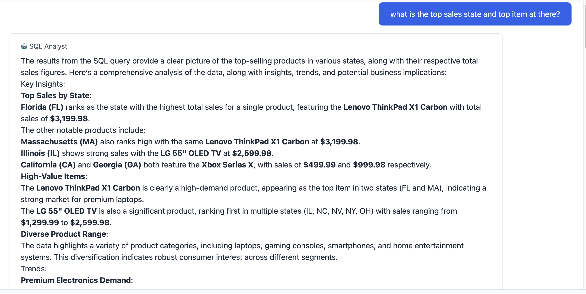
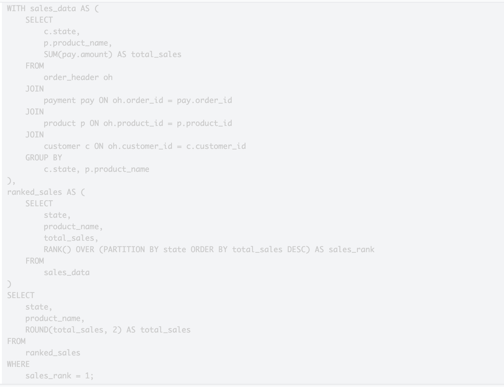

# SQL Generator (Internal Use)

An AI-powered SQL query generation system for internal analytics use. Converts natural language business questions into optimized SQL queries with automatic error handling, validation, and result analysis.

## Overview

The SQL Generator enables business users and analysts to query data using natural language, eliminating the need for SQL expertise. 

## Business Value

### Democratized Data Access

- **No SQL Knowledge Required**: Business users can ask questions in plain English
- **Faster Insights**: Get answers in seconds instead of waiting for data team

### Operational Efficiency

- **Reduced Query Time**: Instant SQL generation vs. manual query writing
- **Error Reduction**: Automatic validation prevents incorrect results
- **Intelligent Retry**: System automatically corrects and retries failed queries

### Enhanced Decision Making
- **AI-Powered Insights**: Automatic analysis of query results with business context

## Core Capabilities

### 1. Natural Language to SQL Conversion
**Function**: Enable sales/marketing team access to database and get insights from

- Enables non-technical users to access data independently
- Reduces time from question to answer

### 2. Intelligent Question Classification

**Function**: Automatically determines if a question requires database access or is conversational
- Routes questions appropriately without user intervention
- Handles both data queries and general questions

**Question Categories**:

- **SQL Questions**: Require database queries (e.g., "What is total revenue?")
- **Conversational Questions**: General inquiries (e.g., "How does this system work?")

### 3. Result Validation
**Function**: Ensures query results actually answer the user's question
**Value**:
- Prevents misleading or incomplete answers
- Automatically retries with corrected queries when validation fails

### 4. AI-Powered Result Analysis
**Function**: Generates insights and recommendations from query results
**Value**:
- Transforms raw data into actionable insights
- Identifies trends and patterns automatically
- Explains business implications of findings

## How It Works

### Question Processing Workflow

1. **Question Classification**: System determines if question needs database access
2. **SQL Generation**: Converts natural language to optimized SQL query
3. **Query Execution**: Runs query against database
4. **Result Validation**: Verifies results answer the question correctly
5. **Error Handling**: Automatically corrects and retries if needed
6. **Analysis Generation**: Creates insights and recommendations from results
7. **Response Delivery**: Provides comprehensive answer with data and analysis

### Automatic Error Recovery

When queries fail or produce invalid results:

- System identifies the type of error
- Automatically corrects the query based on error type
- Retries with corrected query (up to configured limit)
- Provides clear explanation if all retries fail

### Multi-Step Processing

The system processes questions through multiple stages:

- Classification to route appropriately
- SQL generation with schema awareness
- Execution with error handling
- Validation to ensure correctness
- Analysis to provide insights
- Response formatting for clarity

## Additional Resources

- [Main Project README](../../README.md)
- [Customer Chatbot Documentation](../chatbot/README.md)
- [Data Engineering Documentation](../../sql/README.md)

---

Example internal sql generation: 

Generated SQL query: 

